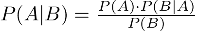
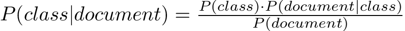
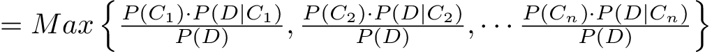

% Finding the good stuff in log files with a Naive Bayesian Classifier
% Scott Weinstein

# Backstory
* Tens of thousands of individual log files
    * Not the ideal way to structure the data, but often we need to work with what we're given
* Most of which had irrelevant garbage
* Some had exception messages, indicating a bug in the code
* Some had error messages, indicating a poor user experience
* Sorting though the files by hand wasn't feasible

# Approaches
* A year ago I would have used some regular expressions to pick out text I thought was important
    * Boring
    * Error prone
    * Hard to maintain "now he has two problems"
* This time, armed with some machine learning theory I tried something else

# What's a Naive Bayesian Classifier?

## Let's look at each word
* **Classifier** - code that makes a prediction about data into a set of enumerated choices (as opposed to say a continuous value)
* **Bayesian** - probabilistic logic which takes advantage of Bayes' theorem
* **Naive** - academic speak for really simple - more on this later

# Where are these used?
* Most famously in spam detectors
* But useful in many document classification problems such as
    * Subject assignment
    * Authorship
    * Age determination
    * Sex determination

## Why this vs other approaches?
* Works surprisingly well
* Easy to understand
* Easy to code (no linear algebra)
* Fast run time

# Demo

# How does it work - theory
### Bayes theorem

### Applied to document classification

### To classify a document we choose the _class_ which gives the highest probability

#### And we can drop the denominator, as it's the same across each

# OK, but what are $P(C_n)$ and $P(D|C_n)$

* $P(C_n)$ is number docs of $Class_n$ relative to the total number of docs
* To compute $P(D|C_n)$ we need to make some simplifing assumptions
    * Order of words doesn't matter
    * 
